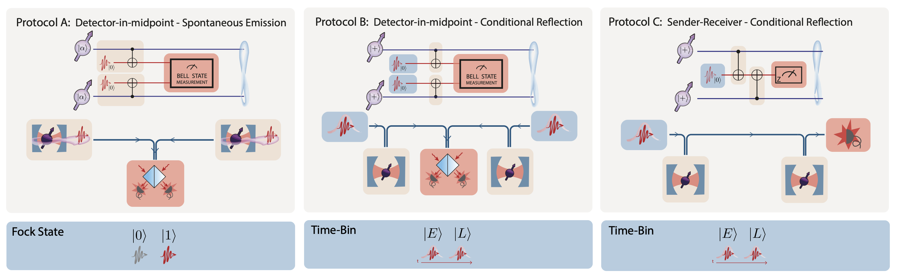

# QuREBB: Quantum Remote Entanglement Building Block Simulations


Welcome to the **QuREBB** repository! Here, we introduce a modular theoretical framework designed for the comprehensive understanding and comparison of various photon-mediated remote entanglement protocols (REPs). This repository is based on the framework and results outlined in the paper ["Tutorial: Remote entanglement protocols for stationary qubits with photonic interface"](https://arxiv.org/abs/2310.19878v1). Structured into four distinct layers, this framework facilitates the assembly of modules by connecting one's output to another's input, elucidating the intricate mechanisms underpinning entanglement.

The primary strength of our framework is its capability to delineate common features inherent to different remote entanglement protocols. Beyond this, it is designed with adaptability at its core, enabling users to modify modules with precision. This adaptability is crucial to compare a protocol across diverse quantum hardware setups or to test an array of protocols on a consistent hardware foundation. Such modularity and precision often remain elusive in dedicated entanglement simulations tailored for specific experimental setups. Dive deep into the intricacies of photon-mediated entanglement generation between qubit systems, and leverage the robust capabilities of our simulation suite.

## Authors
<sup>1</sup> , 
<sup>2</sup> ,

[**Hans Beukers**](mailto:)<sup>1,\*</sup>, [**Matteo Pasini**](mailto:)<sup>1,\*</sup>, [**Hyeongrak Choi**](mailto:)<sup>2,\*</sup>, [**Dirk Englund**](mailto:englund@mit.edu)<sup>2</sup>, [**Ronald Hanson**](mailto:R.Hanson@tudelft.nl)<sup>1</sup>, [**Johannes Borregaard**](mailto:borregaard@fas.harvard.edu)<sup>1</sup>

<sup>\*</sup> These authors equally contributed to this work.

## Structure 


### lib
- **NQobj.py**
  - This file contains the `NQobj` class, an extension of QuTiP's `Qobj`. The core enhancement is the ability to index quantum object modes using descriptive `names` rather than numerical indices. The named indexing feature allows for the operations like $+, \times, \otimes$, $^\dagger, \braket{\cdot|\cdot}$, and others, with `names`.
  - Error handling is in place to ensure that the naming conventions are consistent and non-duplicative.
  - Several helper functions are provided, including functions to find missing names, permute objects, and add missing modes.

- **quantum_optical_modelling.py**
  - This file contains the quantum optical modelling functions to simulate the quantum hardware (e.g. cavity-QED system, laser-qubit interaction, quantum noises).
  - Input: physical parameters, output: parameters describing the response of quantum system. 
  - For instance, the cavity function accepts $\kappa, \gamma, g$ etc. as arguments and returns $t, r$ and $l$ (transmission, reflection and loss).

- **PBB.py**
	- This file contains building-block functions based on physical functionality. 
  - While some functions are self-contained, more complex PBBs leverage the `quantum_optical_modelling.py` for hardware simulation.
  - `PBB` input: physical parameters, `PBB` output: quantum channel (also called unital map, operator sum representation, or completely-positive trace-preserving map)

- **LBB.py**
  - This file contains building-block functions based on logical functionality. 
  - `LBB` functions employs `PBB` functions to craft LBB quantum channels. 
  - `LBB` input: density matrix, `LBB` output: logically process density matrix

- **protocol.py**
	- This file contains the `Protocol` class, that is used to simulate the behaviour of a remote entanglement protocol (REP).
	- It also provides the `ProtocolSweep` class for sweeping parameters in the protocols for fidelity and rate optimization.
	  
- **states.py** 
  - Primarily for convenience and enhanced code readability (e.g. `vacuum()` in stead of `qutip.basis(0,2)`).
	  

### protocols
- **tutorial_protocols.py**
	- The three protocols (A, B, C) from the [QuREBB paper](https://arxiv.org/abs/2310.19878v1) (Figure 7) are implemented in code in this file.
    

### notebooks
- **Example notebook.ipynb**
  - This notebook illustrates the construction of a protocol, exemplified by Protocol C in the referenced document.
  - It details common imports, the definition of a protocol using building blocks, and the execution of parameter sweeps.

### tutorial_simulations
  - This subdirectory contains the notebooks simulating the three protocols (A, B, C) from the [QuREBB paper](https://arxiv.org/abs/2310.19878v1).
  

## Running QuREBB
[](https://pipenv.pypa.io/)

The virtual environment in this QuREBB repository is managed by [pipenv](https://pipenv.pypa.io/en/latest/).
To install pipenv you can use pip:

```bash
$ pip install pipenv --user
```

Using pipenv you then want to install all the dependencies of the repository by syncing with pipenv.
First navigate in the terminal to the QuREBB folder. Then run:

```bash
$ pipenv sync
```

Once you are synced you can go into a shell of this virtual enviroment (again while being in the QuREBB folder):

```bash
$ pipenv shell
```

The commands you now run are within this virtual enviroment, e.g.:

```bash
$ jupyter lab
```

## Dependencies 

The dependencies are formulated in the pipenv file.
Also the pipenv tool can be used to load the correct enviroment (see "running QuREBB").

## License
[](https://opensource.org/licenses/BSD-3-Clause)

QuREBB is licensed under the BSD 3-Clause License, which allows for the free use, modification, and distribution of software as long as certain conditions are met.

See the LICENSE.txt file for more details.

## Citing QuREBB


If you use QuREBB in your research, please cite the original [QuREBB paper](URL_PLACEHOLDER).